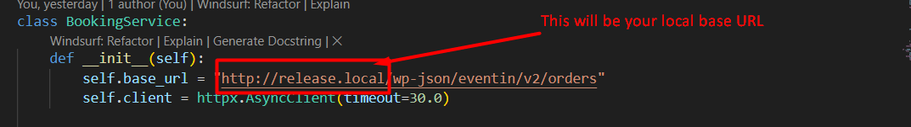
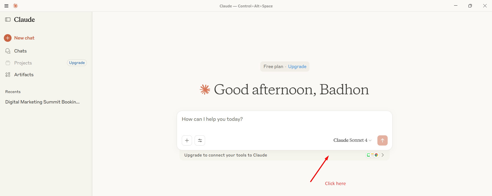
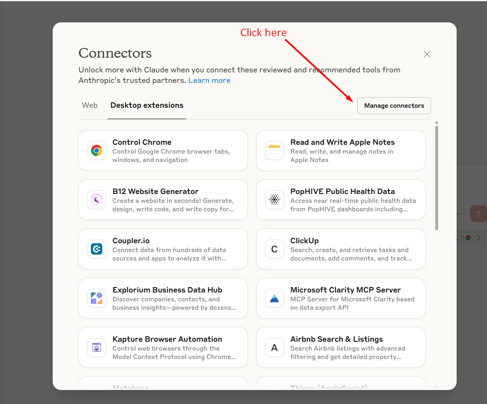
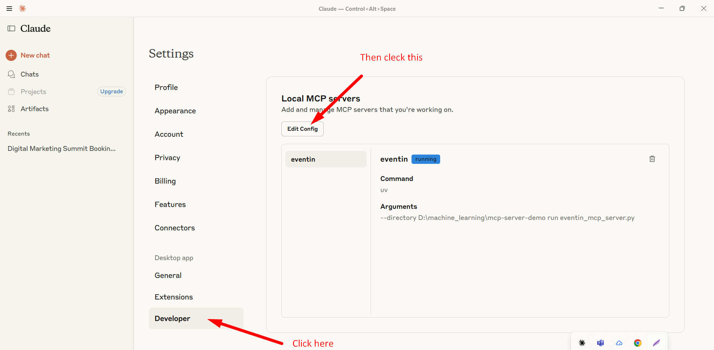
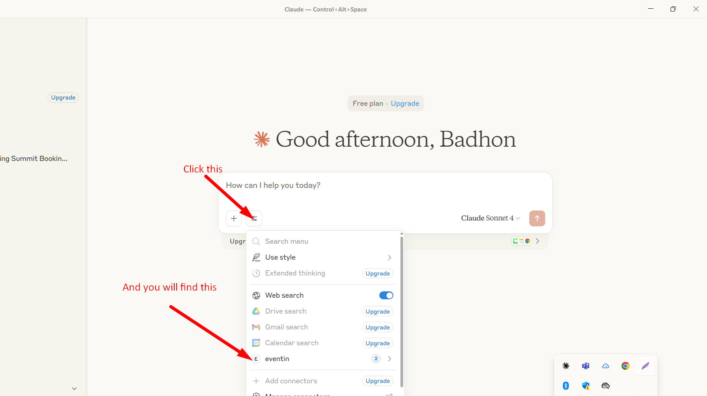

Eventin MCP Server - Quick Start Guide
======================================

Setup Steps:
------------

1. Install Python 3.13 (if not already installed).

2. (Recommended) Create and activate a virtual environment:
   python -m venv .venv
   .\.venv\Scripts\activate

3. Install uv (if not already installed):
   pip install uv

4. Install dependencies:
   uv pip install -r requirements.txt
   OR
   uv pip install -e .

5. Start eventin locally, and check if it's running in the browser properly

6. Replace My base_url your yours

7. 

8. Run the Eventin MCP server:
   uv --directory . run eventin_mcp_server.py

   This will start the MCP server for Eventin bookings.

9. Logs:
   - Server logs are written to booking_server.log in this directory.

======================================

Steps to communicate with our MCP server using claude desktop:
------------

1. Download and install claude desktop
2. Open claude desktop, click "Upgrade to connect your tools to Claude" 
3. Click "Manage Connectors" in right corner 
4. Click "Developer" menu in the left side, and you find "Edit Config" button, click it 
5. After that, you will find "claude_desktop_config.json", here just put following code
```jsx
   {
      "mcpServers": {
         "eventin": {
            "command": "uv",
            "args": [
            "--directory",
            "D:\\machine_learning\\mcp-server-demo", //your directory may be different
            "run",
            "eventin_mcp_server.py"
            ]
         }
      }
   }
```
7. Now you will see that, your mcp tools are connected with the claude 
8. Sample output 

